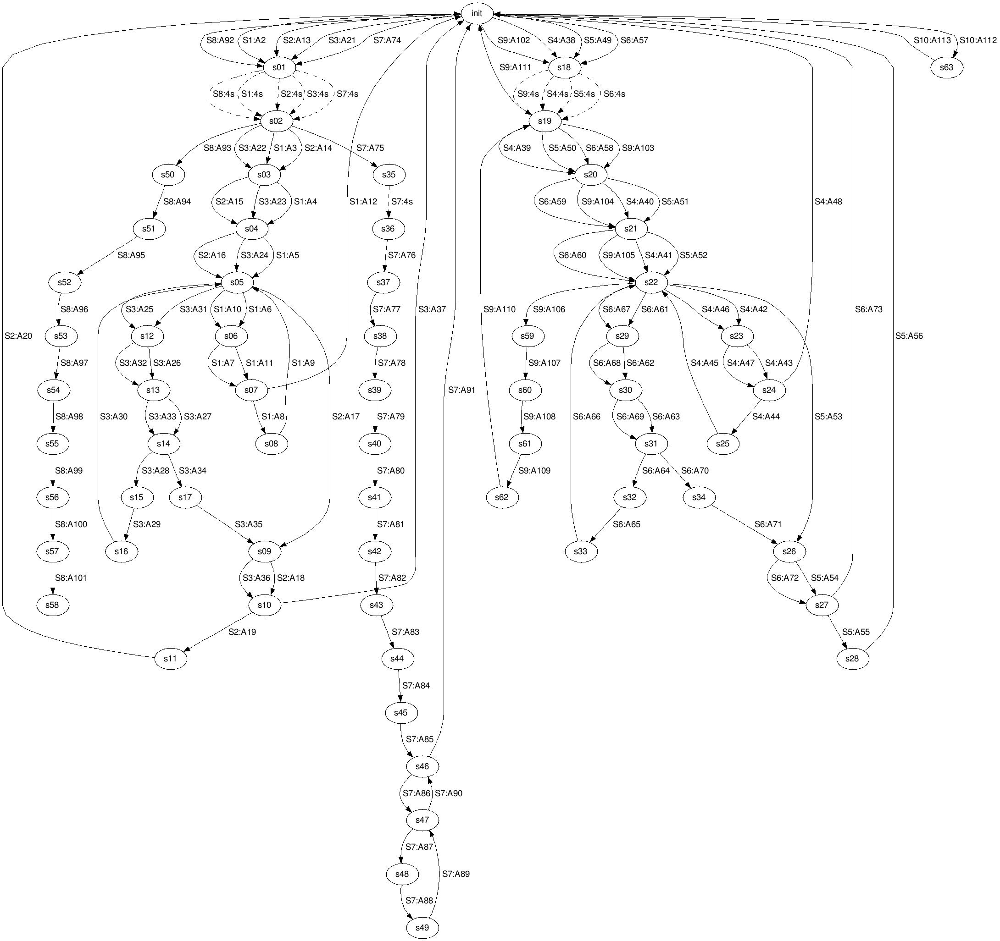

# ProjectClosingDoors

## Problem statement / objective

The electronics department, in DSB electrical engineering, tests and repairs the electronics in DSB's train equipment.

The door control for the IC3 train is tested by a repairman who tests all functions, by connecting a test box to the door control and carefully carrying out everything that is stated in the test regulations.

The test regulations contain 113 points and the repairman must perform all the points, on the test box, in the order in which they are written. Each point is called an action and tells exactly which inputs, in the form of contacts, the repairman must manually influence and how the outputs must react.

When the test is run, it is very long and trivial and you have the feeling that you do the same thing all the time.

The risk of making mistakes in the test is great when testing manually in this way and with so many actions. Furthermore, one can easily be disturbed and forget where one had come to, in the test regulations, and risk jumping back to a previous action. It takes approx. 30-45 minutes to get through the entire test regulation. If the test fails, the repairman must now repair the fault, and the same time is again consumed when testing the door control from scratch, if you want to be sure that there are no other faults.
or that new faults have been introduced during the repair.

So the ultimate goal is to get the test automated by executing the test regulation via a hardware interface (e.g. Raspberry pi), with code written in Python. When the test finds faults, it must stop and give hints to the repairman in connection with troubleshooting and repair.

It brings down the time and eliminates the possibility of errors in performing the test.

### Boundary:

The final goal cannot be achieved within the given deadline, so the project is limited to a sub-goal.

The sub-goal is to make the test box as a printer, in Python, understood in the sense that when the actions are performed on the test box, the test box writes / prints the instruction to the repairman, who must perform the action on the test box that exists today. When the repairman has influenced the input, it must also be answered whether the output is correct in the given action, so that it is also part of the instruction. If there is an error, the repairman will receive an error message.

The 113 actions are grouped into door functions, so that the repairman can in practice choose whether all or a specific door function is to be tested.

That way, the product ends up being an interactive test where the test box asks the repairman to perform the actions. The intention is to eventually replace the test box printer with the hardware interface that automatically performs the actions
and tells if there are errors or not.
The test / test box is also a state machine that again takes the form of a graph.

So I have chosen to make a graph for the test / test box, in order to see if there are many repetitions and if the test can be performed smarter.

## Organization / structure

- Modules in Package PCD  
  
    - **\_\_main__.py**
      > **In this module I run my program with an interactive line-oriented command interpreter.\
      This is where the repair man gets to choose whether he wants to test a specific door-function\
      or test all of it.**
      
    - **actions.py**
      > **In this module I have all my actions which is carried out on the testbox.\
      All the actions are grouped under sequences which represent the different door-functions.**
      
    - **domain.py**
      > **In this module I have all my inputs and outputs.\
      Input and output are used in the actions, as these consist of input that is affected and output that must be verified.**
      
    - **printer.py**
      > **In this module I have all the directions / instructions which is printed / written to the repairman\
      in every action.**
      
    - **statemachine.py**
      > **This module is run separately and writes all the states that the testbox is going through.\
      Besides of that this module is generating the commands for representing the state machine as a directed graph.\
      The graph can be visualized via the commands with a graph visualization software like graphviz.\
      E.g. on this link: http://www.webgraphviz.com/ the digraph commands can be pasted directly in to the field
      and generate a graph. For my statemachine it looks like this:**
    
    

## Explanation of code

- ### General
  
  - pass

- ### Advanced programming technique vs data structure
  
  - Pass

- ### Exciting stuff
  
  -  https://github.com/GiTJiMz/ProjectClosingDoors/blob/99ff5f09429f88748d0aca10517bdcb0dce9adb3/PCD/actions.py#L13-L15

- ### Defects and deficiencies
  
  - #### Defects
    
    When the repairman chooses to run a full test, the actions action_power_off, action_start_position and action_1 are run every time a new door function / sequence starts.  
    The right thing is that the 3 actions only have to run once, and it has to happen just before the first door function is run.  
    Therefore, the text "Testing: Door-function 1: Test of local operation of right door [11]" must also be moved down so that it's above the text
    "Testing: action_2", if you answer yes and thus confirm the correctness of the questions in action_1.
    
  - #### Deficiencies

    1. The repairer must be able to choose how many times a test should be repeated.  
    2. In the vast majority of actions, only one input is stimulated, but there are also some actions where 2 inputs are stimulated.  
       Therefore, after stimulation of each input in the actions, all outputs must be checked so that the error messages can become very specific and thus shorter.  
       Currently it's the repairman who has to stimulate the inputs and answer the questions, and therefore it's only more work for the person in question, but in return it helps to pinpoint the error.  
       The idea is that the test box will be replaced, in the future, by a hardware interface that automates the test. So it would facilitate the programming of the hardware interface, later, if it was implemented in the current test box printer.  
    3. In this version of the program, error message is only entered for one action (action_2 in door function 1), so error messages for 112 actions are missing.  
    4. The error messages must be stored permanently in a file where the repairmen can easily enroll new help for other repairmen.
       From here, the help can be read into the program at startup.  
    5. The code for the state machine has only just been made, and I have generated the image of the graph, but I have not been able to deduce anything from it yet.\
       So I will definitely move on with this in the future and see if it's possible to run the test in a more efficient way without compromising on quality.

## Conclusion

It has been a steep learning curve, as I have both had to get to know Python at the same time as a lot of new concepts.

It has been a good process with very valuable communication with the teacher and fellow students.
This has contributed to me modulating my domain in a good way.

There are mistakes that need to be corrected and there is room for improvement, but it's a completely natural part when working with the development of your product.

Going forward, I will put energy into interpreting on the state machine in order to streamline the test as well as
to figure out how I want to check all outputs after stimulating each input. I think the remaining shortcomings are going to be more affordable to implement.

After this project, I am now left with a product, in the form of a program that we can use at work, as a replacement for the current testing regulation.

I am extremely pleased with the process and the result.